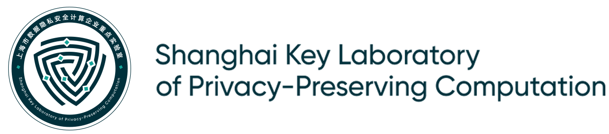

This workshop aims to provide advice for researchers in early stages (students and junior faculty) and women researchers in the area of cryptography. The workshop will bring together cryptography researchers at different stages of their career to form panels and answer questions for these groups. Besides the live events, the organizers will turn to a large group of cryptography researchers and collect pre-recorded answers and advice from them on a list of interesting questions. These answers will be combined into a set of videos showing various perspectives and be publicly available for the community. As the outcome of this workshop, our mission is to foster a friendly environment where the community can openly share their academic experiences.

#### Contact
[mw.cypto@gmail.com](mw.cypto@gmail.com)

### Orgnizers
- Peihan Miao
- Xiao Wang
- Tal Rabin (Orgnizing Advisor)
- Hilarie Orman (Women Researcher Panel Orgnizer)

### Videos
Links to the videos will be posted soon before the workshop.

### Panels
Both panels will happen on Saturday, August 14 2021. The schedule will be announced soon.

#### Junior Researcher Panel
- Shweta Agrawal (IIT Madras)
- Marshall Ball (University of Washigton)
- Aloni Cohen (University of Chicago)
- Sanjam Garg (University of California, Berkeley)
- Abhishek Jain (Johns Hopkins University)
- Lisa Kohl (CWI Amsterdam)
- Antigoni Polychroniadou (J.P. Morgan AI research)

#### Women Researcher Panel
- Helena Handschuh (Rambus Inc.)
- Yael Kalai (Microsoft Research New England and MIT)
- Anna Lysyanskaya (Brown University)
- Hilarie Orman (Cryptic Labs LLC)
- Tal Rabin (University of Pennsylvania and Algorand Foundation)
- Rei Safavi-Naini (University of Calgary)

### Sponsors 
This workshop is supported by Shanghai Key Laboratory of Privacy-Preserving Computation and MatrixElements Technologies.

