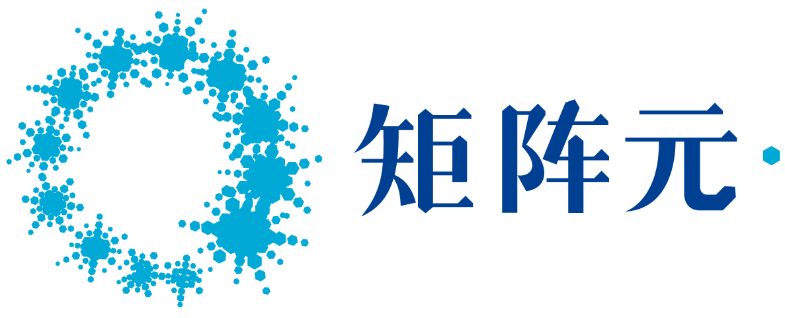

## About
This workshop aims to provide advice for researchers in early stages (students and junior faculty) and women researchers in the area of cryptography. The workshop will bring together cryptography researchers at different stages of their career to form panels and answer questions for these groups. Besides the live events, the organizers will turn to a large group of cryptography researchers and collect pre-recorded answers and advice from them on a list of interesting questions. These answers will be combined into a set of videos showing various perspectives and be publicly available for the community. As the outcome of this workshop, our mission is to foster a friendly environment where the community can openly share their academic experiences.

---
## Registration
The workshop is an affiliated event of [CRYPTO 2021](https://crypto.iacr.org/2021/). To register to the workshop, please register to CRYPTO 2021, and mark this workshop in the registration form.

---
## Panels
Both panels will happen on August 14 2021 (Saturday).

#### Junior Researcher Panel
Tentative schedule: ***8:30 am - 10:00 am PDT***
- [Shweta Agrawal](https://www.cse.iitm.ac.in/~shwetaag/) (IIT Madras)
- [Marshall Ball](http://www.columbia.edu/~mmb2249/) (University of Washigton)
- [Aloni Cohen](https://aloni.net) (Boston University and University of Chicago)
- [Akshay Degwekar](https://toc.csail.mit.edu/user/198) (TwoSigma)
- [Sanjam Garg](https://people.eecs.berkeley.edu/~sanjamg/) (University of California, Berkeley and NTT)
- [Abhishek Jain](https://www.cs.jhu.edu/~abhishek/) (Johns Hopkins University)
- [Lisa Kohl](https://lisakohl.me) (CWI Amsterdam)
- [Antigoni Polychroniadou](https://antigonip.github.io) (J.P. Morgan AI research)

#### Women Researcher Panel
Tentative schedule: ***12:00 pm - 13:30 pm PDT***
- [Helena Handschuh](https://www.rambus.com/inventors/inventor-helena-handschuh/) (Rambus Inc.)
- [Yael Kalai](https://www.microsoft.com/en-us/research/people/yael) (Microsoft Research New England and MIT)
- [Anna Lysyanskaya](http://cs.brown.edu/people/alysyans/) (Brown University)
- [Hilarie Orman](https://crypticlabs.org/hilarie-orman/) (Cryptic Labs LLC)
- [Tal Rabin](https://directory.seas.upenn.edu/tal-rabin/) (University of Pennsylvania and Algorand Foundation)
- [Rei Safavi-Naini](http://pages.cpsc.ucalgary.ca/~rei/) (University of Calgary)

---
## Videos
Here is the [playlist of all the videos](https://www.youtube.com/playlist?list=PLqCT4KpIiKPb70QW8tI4aSuDpuNgyz_A2).

#### General Advice:
- Q1. How do you find a research topic/problem to work on? [[video](https://youtu.be/ldc0R8EksTI)]
- Q2. How do you write a research paper? How to write a good paper? [[video](https://youtu.be/PaiKQOTQhcI)]
- Q3. How do you prepare for a research talk? How to give a good talk? [[video](https://youtu.be/XBhJ-fRLsXE)]
- Q4. How do you write a paper review? How to write a good review? [[video](https://youtu.be/e0ZwrS2TmbQ)]
- Q5. Was there a certain point where you doubted yourself whether you could really do this? Was there a turning point where you started to believe that you could do it? [[video](https://youtu.be/6U-h5eYjQ3g)]
- Q6. How do you manage your time? How do you allocate your time between work and other things? [[video](https://youtu.be/yszeQMblXpY)]
- Q7. There were 1600+ papers on ePrint in 2020. How do you choose which papers to read and how do you read them? [[video](https://youtu.be/_kwJGSbhFaU)]

**Advice for PhD Students:**
- Q8. What’s your advice to start the first research project in cryptography? [[video](https://youtu.be/W5iQyyPg7ps)]
- Q9. What was the hardest part during your PhD? How did you overcome it? [[video](https://youtu.be/e8kS6o38ZI8)]
- Q10. Is it advisable to do a postdoc before searching for a faculty/research position? [[video](https://youtu.be/wVsmBC51aLY)]
- Q11. How to find a postdoc/faculty/industrial job? How to prepare for job interviews? [[video](https://youtu.be/1jQR0SwRRAU)]
- Q12. What are the pros and cons between academia and industry? [[video](https://youtu.be/_0km2NQJAWk)]

**Advice for Junior Faculty:**
- Q13. How did you build up your research group? How do you attract/find good students? [[video](https://youtu.be/MNXO--MmKXo)]
- Q14. How do you advise your students? [[video](https://youtu.be/VZEltRP31PU)]
- Q15. How to get grants? [[video](https://youtu.be/xJimcPcwLPM)]
- Q16. How to design a good course? How to be a good teacher? [[video](https://youtu.be/aXxCmnKD9ZQ)]
- Q17. Time is limited. What should I focus on and what should I drop? [[video](https://youtu.be/4U1ad-7nM2A)]

**Questions/Advice for Women:**
- Q18. Did you feel any challenges particular to women? How did you overcome those? [[video](https://youtu.be/bAqJOI4zsbI)]
- Q19-20. Do you feel you have equal opportunities to men? How were you encouraged to get into computer science and cryptography? [[video](https://youtu.be/wnpSn_00mHU)]
- Q21. What do you think the community could do better to attract more women students? [[video](https://youtu.be/6yvtrhf2Rv8)]

**Q22. Any final thoughts/advice? [[video](https://youtu.be/d4w2nNpp9Cw)]**

**Group Interviews:**
- Tal Rabin with her women friends (Elette Boyle, Shafi Goldwasser, Yael Kalai, Tal Malkin) [[video](https://youtu.be/brf0d0180eU)]
- Tal Rabin with her Algorand friends (Fabrice Benhamouda, Craig Gentry, Shai Halevi, Hugo Krawczyk) [[video](https://youtu.be/brf0d0180eU)]

---
## Organizers
- [Peihan Miao](https://sites.google.com/view/peihanmiao/home) (University of Illinois at Chicago)
- [Xiao Wang](https://wangxiao1254.github.io) (Northwestern University)
- [Tal Rabin](https://directory.seas.upenn.edu/tal-rabin/) (University of Pennsylvania and Algorand Foundation), Workshop Advisor
- [Hilarie Orman](https://crypticlabs.org/hilarie-orman/) (Cryptic Labs LLC), Women Researcher Panel

**Contact** [peihan@uic.edu](peihan@uic.edu) and [wangxiao@northwestern.edu](wangxiao@northwestern.edu)

---
## Sponsors 
This workshop is supported by Shanghai Key Laboratory of Privacy-Preserving Computation and MatrixElements Technologies.

